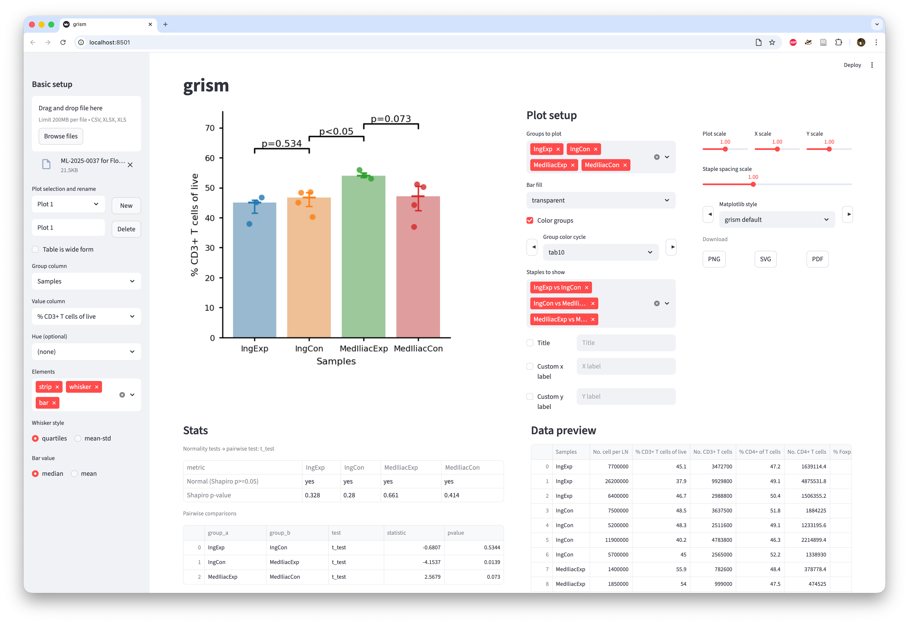

# grism

Simple grouped plots with stats and annotations.



## Install

Create and activate an envionment, e.g.
```bash
conda create -n grism python
conda activate grism
```

Install from GitHub
```bash
git clone https://github.com/drgmk/grism.git
```

```bash
cd grism
pip install .
```

## Run UI

```bash
./run_streamlit.sh
```
