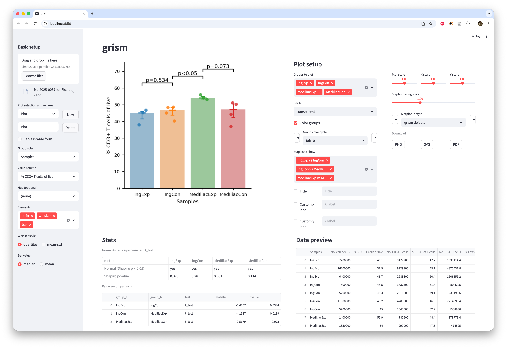

# grism

A spec-driven wrapper around [seaborn](https://seaborn.pydata.org/) for
publication figures: seaborn's grammar, plus overlaid stats and significance
annotations, authored in Python, a UI, or a JSON spec.



grism uses seaborn's vocabulary (`x`, `y`, `hue`, `order`, `palette`,
`estimator`) so you can look anything up in the seaborn docs. On top of that it
adds a few grism-specific extras: `elements` (stack strip + bar + whisker in one
call), `whisker_mode`, `bar_fill`, automatic normality-driven test selection,
and significance staples.

## Install

Create and activate an environment, e.g.
```bash
conda create -n grism python
conda activate grism
```

Install from GitHub
```bash
git clone https://github.com/drgmk/grism.git
cd grism
pip install .            # add [ui] for the Streamlit app, [api] for the service
```

## Python API

```python
import pandas as pd, grism

df = pd.read_csv("data.csv")

# reads like a seaborn call, but overlays elements + stats
ax, omnibus, pairwise = grism.plot_with_stats(
    df, x="treatment", y="tumour_volume",
    elements=["strip", "bar", "whisker"],
    palette="Set2", estimator="median",
    order=["ctrl", "low", "high"],
    test="t_test",        # or "mann_whitney", "anova", "kruskal_wallis"
)
ax.figure.savefig("figure.pdf", bbox_inches="tight")
```

`grism.plot(...)` draws without stats; `grism.stats(...)` runs the tests alone.
For normality-driven test selection (`test="auto"`), use a spec via `render()`
(below) — the spec layer resolves `auto` to a t-test or Mann-Whitney per group.

## Specs and templates

A **`PlotSpec`** describes a plot as data (JSON): the data binding plus
appearance, stats, and labels. A **`PlotTemplate`** is a spec minus its data
binding — a reusable "house style" you apply to new datasets. Both carry a
`spec_version` for forward-compatible loading.

```python
from grism import PlotSpec, DataBinding, render, render_bytes

spec = PlotSpec(name="tumour", data=DataBinding(x="treatment", y="tumour_volume"))
open("spec.json", "w").write(spec.to_json())

res = render(spec, df)                       # -> RenderResult (figure + stats)
open("plot.pdf", "wb").write(render_bytes(spec, df, fmt="pdf"))

# reuse the look on a different dataset
template = spec.to_template()
fig = render_bytes(template.bind(DataBinding(x="group", y="response")), other_df)
```

The UI, CLI, and API all render through the same `render()` seam, so a spec
produces an identical figure everywhere.

grism ships a small library of built-in templates (`grism.list_templates()`,
`grism.load_template("default")`). On the CLI, `grism apply`/`grism figure`
accept a built-in name in place of a JSON file; `grism templates` lists them.
Add your own by dropping a `PlotTemplate` JSON into `grism/templates/`.

## Multiple panels

For a wide sheet with a sample column (the x categories) and many value columns,
turn one template into one panel per column and lay them out N-per-page:

```python
import grism
from grism import PlotTemplate, AppearanceSpec

tmpl = PlotTemplate(name="panel", appearance=AppearanceSpec(palette="Set2"))
fig_spec = grism.figure_from_columns(
    tmpl, x="sample", y_columns=["marker_0", "marker_1", ...],  # 12 columns
    ncols=2, panels_per_page=4,                                 # -> 3 pages of 4
)

grism.render_pages(fig_spec, df)                 # list[Figure], one per page
open("panels.pdf", "wb").write(grism.render_pdf_bytes(fig_spec, df))   # one multi-page PDF
grism.render_page_images(fig_spec, df, fmt="png")                      # list[bytes], one per page
```

Each panel is drawn by the single-panel `render()` (its own stats, palette,
labels) — `figure.py` only handles layout and pagination.

## Command line

```bash
grism render spec.json data.csv -o figure.pdf          # render a saved spec
grism apply template.json data.csv --x treatment --y tumour_volume -o fig.png
grism figure template.json wide.csv --x sample --per-page 4 -o panels.pdf
grism render-figure figspec.json wide.csv -o panels.pdf   # a saved FigureSpec
grism schema > plotspec.schema.json                    # JSON Schema for the spec
```

`grism figure` defaults to all numeric columns except `--x`; pass `--y` (repeat)
to choose. `.pdf` output is one multi-page file; `png`/`svg` write one file per
page (`panels_p0.png`, ...).

## HTTP API

```bash
pip install ".[api]"
grism serve                      # http://127.0.0.1:8000  (docs at /docs)
```

POST data (as records) plus a spec, get a figure back:

```bash
curl -X POST http://127.0.0.1:8000/render -H 'Content-Type: application/json' \
  -d '{"spec": {"data": {"x": "treatment", "y": "tumour_volume"}},
       "data": [{"treatment": "ctrl", "tumour_volume": 10.2}, ...],
       "fmt": "png"}' -o figure.png
```

Endpoints: `POST /render` (spec + data), `POST /apply` (template + binding +
data), `POST /render-figure` (multi-panel FigureSpec + data → PDF, or a zip of
per-page images for png/svg), `GET /schema`, `GET /health`.

## UI

```bash
./run_streamlit.sh
```

Interactively build plots, then download the figure (PNG/SVG/PDF) or the
**spec / template JSON** to reproduce or reuse it from the CLI or API.
